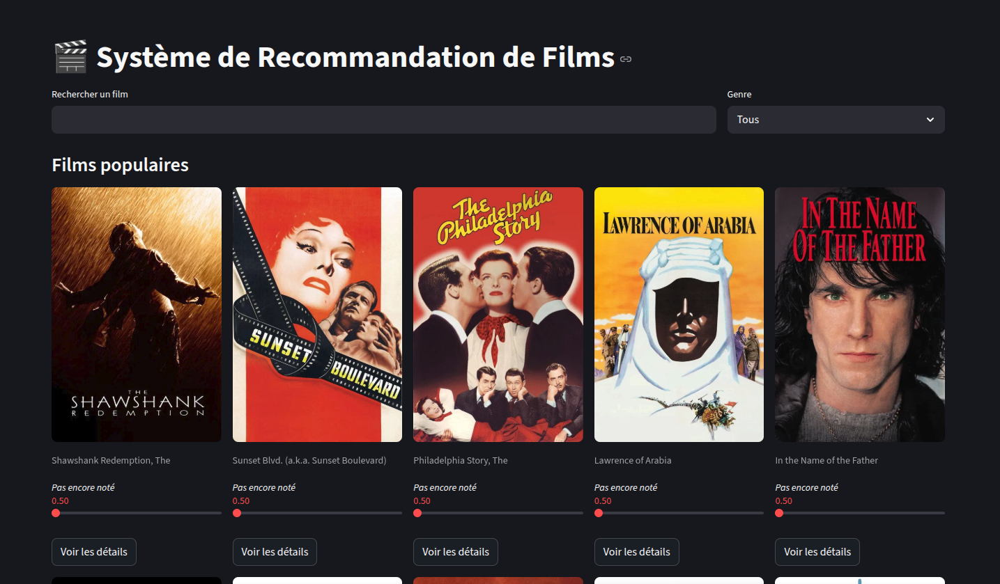
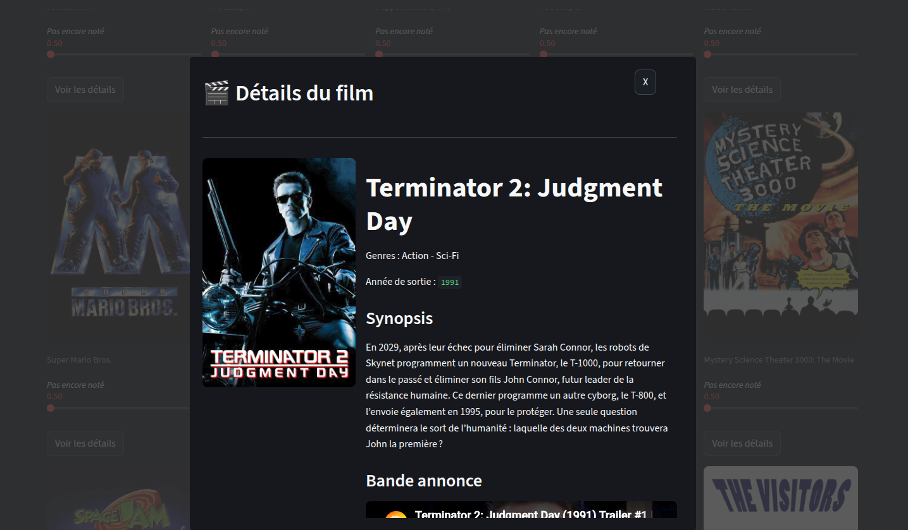
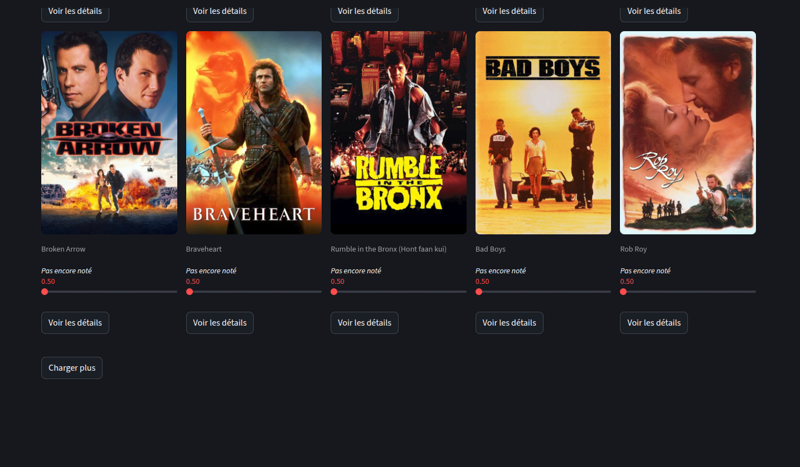

# Système de recommandation

## 1. Introduction

Dans un contexte marqué par la croissance exponentielle des données numériques, les systèmes de recommandation occupent une place centrale dans de nombreuses applications modernes, notamment dans les domaines du e-commerce, du streaming et des réseaux sociaux. Leur objectif principal est d’aider les utilisateurs à découvrir des contenus pertinents en fonction de leurs préférences, souvent implicites.

Ce projet s’inscrit dans le cadre d’un travail pratique (TP) en Big Data et a pour objectif de concevoir et d’implémenter un système de recommandation basé sur le filtrage collaboratif. Plus précisément, l’approche retenue repose sur une méthode item-item, qui consiste à recommander des éléments similaires à ceux déjà appréciés par l’utilisateur.

L’application développée s’appuie sur le jeu de données MovieLens et propose une interface interactive permettant aux utilisateurs de :

* s’inscrire et se connecter,
* attribuer des notes à des films,
* explorer un catalogue de films via des fonctionnalités de recherche et de filtrage,
* recevoir des recommandations personnalisées.

Une attention particulière a été portée à l’expérience utilisateur, avec la mise en place d’une interface moderne inspirée des plateformes de streaming telles que Netflix, intégrant notamment des cartes de films visuelles, un système de notation intuitif et une navigation fluide.

Enfin, ce projet met en œuvre plusieurs concepts clés liés au Big Data et aux systèmes de recommandation, notamment la manipulation de matrices creuses, le calcul de similarité entre items, ainsi que l’optimisation des performances via des techniques de mise en cache et d’indexation.


## 2. Présentation du système de recommandation

### 2.1 Type de recommandation

Le système de recommandation développé dans ce projet repose sur une approche de **filtrage collaboratif**. Cette méthode consiste à exploiter les interactions passées des utilisateurs (notamment les notes attribuées aux films) afin de proposer des recommandations pertinentes, sans nécessiter d’informations explicites sur le contenu des films.

Plus précisément, le choix s’est porté sur une approche **item-item**. Contrairement aux méthodes user-user qui comparent les profils d’utilisateurs, l’approche item-item consiste à mesurer la similarité entre les éléments (ici, les films). L’idée principale est la suivante : *si deux films sont souvent notés de manière similaire par un grand nombre d’utilisateurs, alors ils sont considérés comme proches*.

Ainsi, lorsqu’un utilisateur apprécie un film donné, le système est capable de lui recommander d’autres films similaires en se basant sur les comportements collectifs observés dans les données.

### 2.2 Fonctionnement global

Le fonctionnement du système de recommandation peut être décomposé en plusieurs étapes principales :

**1. Données d’entrée (ratings)**
Le système s’appuie sur une base de données contenant les évaluations (ratings) attribuées par les utilisateurs aux films. Ces données sont structurées sous la forme de triplets *(user_id, movie_id, rating)*.

**2. Construction de la matrice utilisateur-item**
À partir des données de notation, une matrice creuse (*sparse matrix*) est construite, où :

* les lignes représentent les utilisateurs,
* les colonnes représentent les films,
* les valeurs correspondent aux notes attribuées.

**3. Calcul des similarités entre films**
Une mesure de similarité (cosinus) est appliquée entre les colonnes de la matrice afin d’évaluer la proximité entre les films. Cela permet d’identifier quels films sont similaires en fonction des comportements des utilisateurs.

**4. Génération des recommandations**
Pour un utilisateur donné, le système :

* identifie les films qu’il a déjà notés positivement,
* récupère les films similaires à ceux-ci,
* agrège les scores de similarité,
* exclut les films déjà vus,
* retourne une liste de films recommandés (Top-N).

**5. Gestion du cas "cold start"**
Lorsque l’utilisateur n’a pas encore fourni suffisamment de notes, le système ne peut pas générer de recommandations personnalisées fiables. Dans ce cas, un mécanisme de repli est utilisé, basé sur la popularité des films (films les mieux notés ou les plus évalués).


## 3. Jeu de données

### 3.1 Source des données

Le système de recommandation s’appuie sur le jeu de données **MovieLens (ml-latest-small)**, mis à disposition par le GroupLens Research Group. Ce dataset est largement utilisé dans la recherche et l’enseignement pour expérimenter des algorithmes de recommandation.

### 3.2 Description

Le jeu de données utilisé présente les caractéristiques suivantes :

* **Nombre d’utilisateurs** : 610
* **Nombre de films** : 9 742
* **Nombre de ratings** : 100 836

Les notes sont comprises entre 0.5 et 5.0, avec un pas de 0.5. Chaque utilisateur a évalué au minimum 20 films, garantissant ainsi un certain niveau de densité dans les données.

Le dataset comprend plusieurs fichiers, dont les principaux utilisés dans ce projet sont :

* `movies.csv` : informations sur les films (titre, genres)
* `ratings.csv` : évaluations des utilisateurs
* `links.csv` : correspondances avec des identifiants externes (notamment TMDB)

### 3.3 Prétraitement

Avant leur utilisation, les données ont subi plusieurs étapes de prétraitement afin d’améliorer leur qualité et leur exploitabilité :

**Nettoyage des titres**
Les titres des films contenaient l’année de sortie entre parenthèses (ex : *"Inception (2010)"*). Cette information a été supprimée afin de simplifier l’affichage dans l’interface utilisateur.

**Gestion des genres**
Les genres, initialement stockés sous forme de chaînes séparées par le caractère `|`, ont été conservés sous forme textuelle mais exploités dynamiquement dans l’application pour permettre le filtrage par genre.

**Jointure avec TMDB**
Grâce aux identifiants fournis dans le fichier `links.csv`, une intégration avec l’API TMDB (The Movie Database) a été réalisée afin d’enrichir les données avec :

* les affiches des films,
* les synopsis,
* les bandes-annonces.

Cette étape a permis d’améliorer significativement l’expérience utilisateur en rendant l’interface plus visuelle et interactive.


## 4. Architecture du projet

### 4.1 Organisation des fichiers

Le projet est organisé de manière modulaire afin de faciliter la lisibilité, la maintenance et l’évolution du code. La structure principale est la suivante :

```bash
project/
│
├── app/
│   ├── app.py
│   ├── pages/
│   ├── recommender.py
│   ├── user.py
│   ├── ratings.py
│   └── tmdb.py
├── data/
├── scripts/
├── uploads/
├── .env
├── .env.example
├── .gitignore
├── app.db
├── README.md
└── requirements.txt
```

**Description générale :**

* **app/** : contient l’ensemble du code de l’application Streamlit
* **pages/** : regroupe les différentes pages (Home, Profile, Login, Register)
* **data/** : fichiers issus du dataset MovieLens (et versions nettoyées)
* **scripts/** : scripts utilitaires (initialisation de la base de données, tests, preprocessing)
* **uploads/** : stockage des photos de profil utilisateurs
* **.env** : variables d’environnement (clé API TMDB, etc.)
* **app.db** : base de données SQLite
* **README.md** : documentation du projet
* **requirements.txt** : liste des librairies Python nécessaire à l'exécution du projet

### 4.2 Description des modules

Le projet est structuré autour de plusieurs modules principaux, chacun ayant une responsabilité bien définie.

#### Authentification (`user.py`)

Ce module gère tout ce qui concerne les utilisateurs :

* création de compte (inscription)
* validation des données (format email, mot de passe, etc.)
* authentification (connexion)
* gestion des informations utilisateur (nom, prénom, photo, etc.)
* hachage sécurisé des mots de passe avec **bcrypt**

Il assure également une séparation entre les utilisateurs du dataset MovieLens et ceux de l’application grâce à un offset des identifiants.

#### Recommandation (`recommender.py`)

Ce module implémente le cœur du système de recommandation :

* chargement et mise en cache des données
* construction de la matrice utilisateur-item (sparse matrix)
* calcul de similarité entre films (cosine similarity)
* génération des recommandations personnalisées (Top-N)
* calcul des films populaires (fallback)

Il constitue la partie algorithmique principale du projet.

#### Gestion des notes (`ratings.py`)

Ce module permet de gérer les interactions utilisateur :

* ajout ou mise à jour d’une note
* récupération de la note d’un utilisateur pour un film donné
* suppression des notes (ex : reset du profil utilisateur)

Il joue un rôle clé dans la personnalisation des recommandations.

#### Intégration TMDB (`tmdb.py`)

Ce module permet d’enrichir les données grâce à l’API TMDB :

* récupération des affiches de films
* récupération des synopsis
* récupération des bandes-annonces

Les données sont généralement mises en cache afin d’optimiser les performances et limiter les appels API.

#### Interface utilisateur (`app/` et `pages/`)

L’interface utilisateur est développée avec Streamlit et organisée en plusieurs pages :

* **Login / Register** : gestion de l’authentification
* **Home** : affichage des recommandations, recherche, filtres
* **Profile** : gestion des informations utilisateur et du profil de goût

Des composants personnalisés ont été développés pour améliorer l’expérience utilisateur :

* cards de films (style Netflix)
* système de notation interactif
* navigation personnalisée (navbar)

#### Base de données (`app.db`)

Le projet utilise une base de données SQLite pour stocker :

* les utilisateurs
* les films
* les notes

Elle est initialisée via des scripts dédiés et optimisée à l’aide d’index pour améliorer les performances des requêtes.

#### Scripts utilitaires (`scripts/`)

Ce dossier contient des scripts essentiels au bon fonctionnement du projet :

* initialisation de la base de données (`init_db.py`)
* prétraitement des données
* tests du moteur de recommandation

Ces scripts permettent de préparer l’environnement avant le lancement de l’application.


## 5. Base de données

### 5.1 Choix de SQLite

Le système de gestion de base de données retenu pour ce projet est **SQLite**. Ce choix s’explique par plusieurs avantages adaptés au contexte du TP :

* **Simplicité d’utilisation** : SQLite ne nécessite pas de serveur de base de données séparé. La base est stockée dans un simple fichier (`app.db`), ce qui facilite grandement le développement et les tests.
* **Portabilité** : le fichier de base de données peut être facilement déplacé ou partagé, ce qui permet une exécution simple du projet sur différentes machines sans configuration complexe.
* **Adaptation au projet** : pour une application de démonstration et un volume de données modéré (MovieLens latest-small), SQLite est largement suffisant en termes de performance.

### 5.2 Schéma des tables

La base de données est composée de trois tables principales :

#### Table `users`

Cette table contient les informations relatives aux utilisateurs de l’application :

* `id` : identifiant unique de l’utilisateur
* `email` : adresse email (unique)
* `password` : mot de passe hashé
* `first_name` : prénom
* `last_name` : nom
* `profile_picture` : chemin vers la photo de profil (optionnel)
* `birth_date` : date de naissance (optionnel)
* `gender` : sexe (optionnel)
* `created_at` : date de création du compte

#### Table `movies`

Cette table contient les informations sur les films issus du dataset MovieLens :

* `id` : identifiant du film
* `title` : titre du film
* `genres` : genres associés au film (stockés sous forme de texte séparé)
* `year` : année de sortie
* `tmdb_id` : identifiant TMDB utilisé pour récupérer les informations enrichies (affiches, synopsis)

#### Table `ratings`

Cette table stocke les interactions entre utilisateurs et films :

* `id` : identifiant unique de la note
* `user_id` : identifiant de l’utilisateur
* `movie_id` : identifiant du film
* `rating` : note attribuée (0.5 à 5)
* `created_at` : date d’enregistrement de la note

Des clés étrangères assurent la cohérence avec la table `movies`.

### 5.3 Particularités techniques

Plusieurs choix techniques ont été effectués afin d’assurer la cohérence et la performance du système :

#### Offset des `user_id`

Les identifiants des utilisateurs de l’application commencent à une valeur strictement supérieure à ceux du dataset MovieLens (offset > 1000).
Cela permet d’éviter tout conflit entre les utilisateurs du dataset et ceux créés dans l’application.

#### Index pour optimisation

Des index ont été ajoutés sur les colonnes fréquemment utilisées dans les requêtes, notamment :

* `ratings(user_id)`
* `ratings(movie_id)`
* `movies(tmdb_id)`

Ces index améliorent significativement les performances lors des opérations de filtrage et de jointure.

#### Gestion unifiée des ratings

Toutes les notes, qu’elles proviennent du dataset initial ou des utilisateurs de l’application, sont stockées dans une seule table `ratings`.
Ce choix permet :

* une simplification du modèle de données,
* une uniformisation du calcul des recommandations,
* une meilleure exploitation des données pour le filtrage collaboratif.


## 6. Implémentation du moteur de recommandation

### 6.1 Construction de la matrice utilisateur-item

Le moteur de recommandation repose sur la construction d’une **matrice utilisateur-item**, également appelée matrice de feedback implicite/explicite. Dans ce projet, les interactions sont explicites puisqu’elles correspondent aux notes attribuées par les utilisateurs aux films.

Cette matrice est construite à partir de la table `ratings`, où :

* les lignes représentent les utilisateurs,
* les colonnes représentent les films,
* les valeurs correspondent aux notes (ratings).

Étant donné la nature des données (matrice très creuse, car chaque utilisateur n’évalue qu’une petite partie des films), une structure de type **matrice creuse (sparse matrix)** est utilisée. Cela permet de réduire fortement la consommation mémoire et d’améliorer les performances de calcul.

### 6.2 Calcul de similarité

Afin de mesurer la proximité entre les films, une mesure de similarité est appliquée sur les colonnes de la matrice utilisateur-item.

Le choix retenu est la **similarité cosinus (cosine similarity)**. Cette métrique est particulièrement adaptée aux données de recommandation car elle mesure l’angle entre deux vecteurs plutôt que leur magnitude, ce qui permet de comparer des films indépendamment du nombre total de notes reçues.

Deux films sont considérés comme similaires s’ils sont évalués de manière proche par un ensemble d’utilisateurs communs.

### 6.3 Génération des recommandations

Une fois les similarités entre films calculées, le système génère des recommandations personnalisées pour chaque utilisateur selon le processus suivant :

* Identification des films déjà notés par l’utilisateur.
* Sélection des films les plus similaires à ceux ayant reçu les meilleures notes.
* Agrégation des scores de similarité pour produire un classement global.
* Tri des films par score décroissant.
* Sélection des **Top-N films** comme recommandations finales.

Afin d’éviter des recommandations incohérentes, les films déjà vus ou déjà notés par l’utilisateur sont systématiquement exclus du résultat final.

### 6.4 Gestion des cas particuliers

Le système intègre un mécanisme de gestion des cas où les données utilisateur sont insuffisantes pour produire des recommandations fiables, appelé problème de **cold start**.

Dans ce cas, lorsque l’utilisateur n’a pas encore évalué un nombre suffisant de films (limite fixée à **5** actuellement), le moteur de recommandation collaboratif ne peut pas exploiter efficacement ses préférences.

Une stratégie de repli est alors utilisée :

* les recommandations sont basées sur la **popularité globale des films**,
* les films les mieux notés ou les plus fréquemment évalués sont proposés,
* cela permet de fournir une expérience utilisateur cohérente même en absence de données personnelles.

Ce mécanisme garantit que chaque utilisateur reçoit des suggestions pertinentes, même lors de ses premières interactions avec l’application.


## 7. Fonctionnalités de l’application

### 7.1 Authentification

L’application intègre un système d’authentification permettant aux utilisateurs de créer un compte et de se connecter.

* **Inscription** : l’utilisateur doit fournir un email valide, un prénom, un nom et un mot de passe. Une confirmation du mot de passe est requise afin de limiter les erreurs de saisie. Des validations sont effectuées pour garantir la cohérence des données (format de l’email, champs obligatoires, correspondance des mots de passe).
* **Connexion** : l’utilisateur peut accéder à son compte via son email et son mot de passe.
* **Sécurité** : les mots de passe ne sont jamais stockés en clair. Ils sont hachés à l’aide de la bibliothèque `bcrypt`, garantissant un niveau de sécurité adapté au contexte du projet.

### 7.2 Navigation

Afin d’améliorer l’expérience utilisateur, une navigation personnalisée a été mise en place.

* **Navbar verticale** : l’application utilise une barre de navigation verticale permettant d’accéder rapidement aux principales pages (Accueil, Profil, Déconnexion).
* **Redirection automatique** :

  * un utilisateur non authentifié est automatiquement redirigé vers la page de connexion s’il tente d’accéder à une page protégée,
  * un utilisateur connecté est redirigé vers la page d’accueil,
  * après connexion ou déconnexion, la navigation est gérée dynamiquement pour assurer une transition fluide.

### 7.3 Recherche et filtres

L’application propose des outils permettant d’explorer efficacement le catalogue de films.

* **Recherche par titre** : un champ de recherche permet de filtrer les films en fonction d’un mot-clé présent dans le titre.
* **Filtre par genre** : les films peuvent être filtrés selon leur genre (Action, Comedy, Drama, etc.).
* **Pagination ("Charger plus")** : les résultats sont chargés progressivement afin d’optimiser les performances et l’expérience utilisateur. Un bouton "Charger plus" permet d’afficher davantage de résultats sans recharger complètement la page.

Lorsque la recherche ou un filtre est actif, l’affichage se concentre uniquement sur les résultats correspondants, ce qui améliore la lisibilité et la pertinence des informations affichées.

### 7.4 Système de notation

Un système de notation interactif permet aux utilisateurs d’exprimer leurs préférences.

* **Slider de notation** : les utilisateurs peuvent attribuer une note comprise entre 0.5 et 5.0, avec un pas de 0.5.
* **Mise à jour dynamique** : toute modification d’une note est immédiatement enregistrée en base de données.
* **Impact sur les recommandations** : les notes fournies influencent directement le moteur de recommandation. Plus un utilisateur interagit avec l’application, plus les recommandations deviennent pertinentes.

### 7.5 Profil utilisateur

Chaque utilisateur dispose d’une page de profil permettant de gérer ses informations et ses préférences.

* **Informations personnelles** : consultation et modification du prénom, nom et autres informations facultatives.
* **Photo de profil** : possibilité d’ajouter ou de modifier une image de profil.
* **Suppression des notes** : l’utilisateur peut réinitialiser son historique de notation, ce qui permet de repartir de zéro.
* **Taste profile** : une synthèse des préférences de l’utilisateur est générée à partir des films qu’il a notés, permettant de visualiser ses genres favoris.

### 7.6 Détails des films

L’application permet d’accéder à des informations détaillées pour chaque film.

* **Affichage en modal** : les détails d’un film sont affichés dans une fenêtre modale, sans quitter la page principale, améliorant ainsi la fluidité de navigation.
* **Synopsis** : un résumé du film est récupéré via l’API TMDB.
* **Bande-annonce** : lorsqu’elle est disponible, une bande-annonce peut être consultée directement depuis l’interface.

Cette intégration enrichit l’expérience utilisateur en apportant un contenu visuel et informatif supplémentaire.


## 8. Interface utilisateur (UI/UX)

### 8.1 Design choisi

L’interface utilisateur de l’application a été conçue en s’inspirant des plateformes modernes de streaming, notamment Netflix. L’objectif était de proposer une expérience visuelle attractive, intuitive et centrée sur le contenu.

Ce choix de design se traduit par :

* une mise en avant des affiches de films,
* une organisation en sections claires,
* une navigation simplifiée,

Cette approche permet à l’utilisateur de se concentrer sur l’exploration des films et des recommandations.

**Capture d’écran – Page d’accueil :**




### 8.2 Expérience utilisateur

L’expérience utilisateur a été conçue pour être fluide, réactive et intuitive.

**Feedback visuel**

* Les actions utilisateur (notation, navigation, chargement) produisent des effets visibles immédiats.
* Les mises à jour sont dynamiques, sans rechargement complet de la page.

**Navigation fluide**

* Utilisation de redirections automatiques selon l’état de connexion.
* Accès rapide aux différentes sections de l’application.
* Affichage des détails de films sans quitter la page principale (modal).




**Chargement progressif**

* Les résultats de recherche sont chargés progressivement.
* Le bouton "Charger plus" permet d’éviter des temps de chargement trop longs.
* Cette approche améliore la performance perçue et le confort d’utilisation.




## 9. Optimisations techniques

Afin d’assurer de bonnes performances et une expérience utilisateur fluide, plusieurs optimisations ont été mises en place à différents niveaux de l’application.

### Caching (Streamlit)

Le mécanisme de **mise en cache** proposé par Streamlit a été utilisé pour éviter des recalculs coûteux et améliorer les temps de réponse.

* Les données fréquemment utilisées (ratings, films) sont chargées via des fonctions mises en cache.
* Les opérations lourdes, comme la construction de la matrice utilisateur-item ou le calcul des similarités, ne sont exécutées qu’une seule fois tant que les données ne changent pas.
* Le cache est explicitement invalidé lorsque l’utilisateur ajoute ou modifie une note, afin de garantir la cohérence des recommandations.

Cette approche permet de réduire significativement le temps de calcul, en particulier pour le moteur de recommandation.

### Index SQL

Des index ont été ajoutés au niveau de la base de données SQLite afin d’optimiser les requêtes les plus fréquentes.

* Index sur `ratings(user_id)` pour accélérer la récupération des notes d’un utilisateur.
* Index sur `ratings(movie_id)` pour optimiser les opérations liées aux films.
* Index sur `movies(tmdb_id)` pour faciliter les jointures avec les données externes.

Ces index permettent de réduire le temps d’exécution des requêtes, en particulier lors des opérations de filtrage et de génération des recommandations.

### Pagination

Afin d’éviter de charger un grand nombre de films en une seule fois, un système de **pagination** a été mis en place.

* Les résultats sont affichés par blocs (par exemple 20 films à la fois).
* Un bouton "Charger plus" permet d’ajouter progressivement de nouveaux résultats.
* Les résultats déjà affichés sont conservés, évitant ainsi un rechargement complet.

Cette approche permet :

* de réduire la charge côté serveur,
* d’améliorer la performance perçue,
* d’offrir une navigation plus fluide à l’utilisateur.

### Gestion des rerun Streamlit

Streamlit repose sur un modèle d’exécution où le script est relancé à chaque interaction utilisateur. Une gestion fine de ces **reruns** a été nécessaire pour éviter des comportements indésirables.

* Utilisation de `st.session_state` pour conserver l’état de l’application (utilisateur connecté, pagination, résultats, etc.).
* Mise en place de conditions pour éviter des recalculs inutiles.
* Contrôle des déclenchements de `st.rerun()` afin d’éviter des boucles ou des rafraîchissements excessifs.
* Stabilisation des composants interactifs (notamment les sliders de notation) grâce à des clés uniques.


## 10. Limites du projet

Malgré les fonctionnalités mises en place et les optimisations réalisées, ce projet présente certaines limites liées à des choix techniques et au contexte académique du TP.

### Dataset limité (MovieLens small)

Le système repose sur le jeu de données **MovieLens latest-small**, qui reste relativement restreint :

* environ 10 000 films et 100 000 évaluations,
* absence de données récentes (les données s’arrêtent autour de 2018),
* couverture limitée de certains genres ou films récents.

Cela impacte directement la qualité et la diversité des recommandations, notamment pour les utilisateurs ayant des préférences spécifiques.

### Absence de techniques avancées (deep learning)

Le moteur de recommandation repose uniquement sur une approche classique de filtrage collaboratif (item-item).

Aucune méthode plus avancée n’a été implémentée, comme :

* les modèles de factorisation matricielle (SVD, ALS),
* les approches hybrides (contenu + collaboratif),
* les modèles de deep learning (neural recommender systems).

### Sécurité simplifiée

Le système d’authentification, bien que fonctionnel, reste simplifié :

* absence de gestion avancée des sessions (tokens, expiration),
* pas de vérification d’email,
* stockage local des données,
* absence de protection contre certaines attaques (brute force, injection avancée, etc.).

### Limitations de l’interface (Streamlit)

Le choix de Streamlit permet un développement rapide, mais impose certaines contraintes :

* personnalisation limitée de certains composants UI,
* gestion du layout parfois complexe pour des designs avancés,
* modèle de rerun pouvant entraîner des comportements non intuitifs,
* difficulté à implémenter certains éléments interactifs complexes (modals natifs, animations avancées, etc.).


## 11. Installation et utilisation

Cette section décrit les étapes nécessaires pour exécuter le projet localement à partir d’un dépôt vierge.

### 11.1 Prérequis

* Python 3.x installé
* `pip` pour la gestion des dépendances

### 11.2 Installation de l’environnement

Il est recommandé de créer un environnement virtuel afin d’isoler les dépendances du projet.

```bash
python3 -m venv venv
```

Activation de l’environnement :

* **Linux / macOS**

```bash
source venv/bin/activate
```

* **Windows**

```bash
venv\Scripts\activate
```

### 11.3 Installation des dépendances

Installer les bibliothèques nécessaires à partir du fichier `requirements.txt` :

```bash
pip install -r requirements.txt
```

### 11.4 Préparation des données

Avant de lancer l’application, il est nécessaire d'initialiser la base de données :

```bash
python3 scripts/init_db.py
```

Ce script permet :

* de créer les tables SQLite,
* d’insérer les films et les ratings.

### 11.5 Configuration (optionnelle)

Pour pouvoir récupérer les affiches et informations des films (en utilisant l’API TMDB), il est nécessaire de définir une clé API.

Créer un fichier `.env` à la racine du projet :

```env
TMDB_API_KEY=your_api_key_here
```

Un fichier `.env.example` est fourni comme modèle.

### 11.6 Lancement de l’application

Une fois l’environnement prêt et la base de données initialisée, lancer l’application avec :

```bash
streamlit run app/app.py
```

L’application sera accessible via un navigateur à l’adresse indiquée dans le terminal (généralement [http://localhost:8501](http://localhost:8501)).


### 11.7 Utilisation

* Créer un compte via l’interface d’inscription.
* Se connecter à l’application.
* Rechercher des films et attribuer des notes.
* Consulter les recommandations personnalisées.
* Accéder au profil utilisateur pour gérer ses préférences.


## 12. Conclusion générale

Ce projet a permis de concevoir et de développer une application complète de recommandation de films, en s’appuyant sur des techniques classiques de filtrage collaboratif et un jeu de données réel (MovieLens).

L’objectif principal était de mettre en œuvre un système capable de proposer des recommandations personnalisées à partir des interactions utilisateurs. Cet objectif a été atteint grâce à :

* la construction d’une matrice utilisateur-item,
* l’utilisation de la similarité cosinus pour mesurer la proximité entre films,
* la génération de recommandations pertinentes via une approche item-item.

Au-delà de l’aspect algorithmique, le projet a également permis d’aborder des problématiques concrètes de développement :

* conception d’une base de données optimisée,
* gestion de l’authentification et des utilisateurs,
* intégration d’API externes (TMDB),
* création d’une interface utilisateur moderne avec Streamlit,
* gestion des performances et du caching.

L’application obtenue offre une expérience utilisateur cohérente, avec des fonctionnalités clés telles que la recherche de films, la notation interactive, les recommandations personnalisées et la gestion d’un profil utilisateur.

Cependant, certaines limites subsistent, notamment liées au choix du dataset, à l’absence de méthodes avancées de recommandation et aux contraintes de l’outil Streamlit. Ces limites ouvrent la voie à de nombreuses améliorations, comme l’intégration de modèles hybrides, un déploiement en ligne ou encore la refonte du frontend avec des technologies plus flexibles.

En conclusion, ce projet constitue une base solide pour la compréhension et la mise en œuvre de systèmes de recommandation, tout en offrant des perspectives d’évolution vers des solutions plus avancées et proches des standards industriels.
